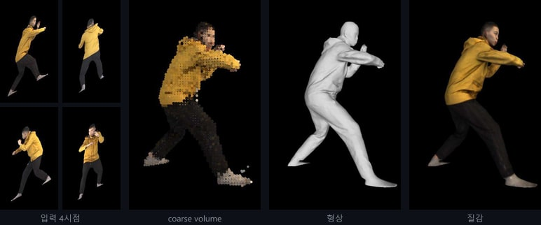

# 홍진규 (JinGyu5175)

영상에서 필요한 정보를 뽑아 실제로 쓰이는 시스템으로 잇는 개발자입니다. 컴퓨터비전 석사 과정에서 다시점 영상 기반 3D 인간 복원을 연구했고, 연구로 끝나지 않는 제품을 만들고 싶어 SSAFY에서 서비스 개발 역량을 넓히고 있습니다. 평균 성능보다 조건이 달라져도 흔들리지 않는 신뢰성을 중요하게 생각합니다.

## Skills

**Languages**

**AI / Computer Vision**

**Backend / Web**

**Others**

## Repositories

- [3d-clothed-human-reconstruction](https://github.com/JinGyu5175/3d-clothed-human-reconstruction) — 다시점 이미지로 옷 입은 사람의 3D 복원 (CVPRW 2024)
- [ssabway](https://github.com/JinGyu5175/ssabway) — 표지판 인식 기반 외국인 역내 안내 서비스 (SSAFY 공통 프로젝트 우수상)

## Publications & Patent

- **3D Clothed Human Reconstruction from Sparse Multi-View Images** — IEEE/CVF CVPR 2024 Workshops (3DMV), 공동 제1저자
- **캘리브레이션 된 2시점 영상으로부터의 3차원 휴먼 복원** — 한국방송·미디어공학회 추계학술대회, 2023
- **다시점 영상으로부터의 3차원 휴먼 복원 방법** — 특허 출원 (KR, US)

## Research Projects

- **다시점 이미지를 이용한 옷을 입은 인간의 3D 복원** (ETRI, 2023) — 3D 복원 모델 구현, 학습 성능 개선, 논문 작성
- **심신안정 및 스트레스 완화 기능성 콘텐츠 플랫폼** (KOCCA·ETRI, 2022) — 실시간 얼굴 랜드마크 추정 (30FPS)
- **무인점포 환경 대응형 영상보안시스템** (IITP, 2023) — 사람의 3D 메쉬 복원
